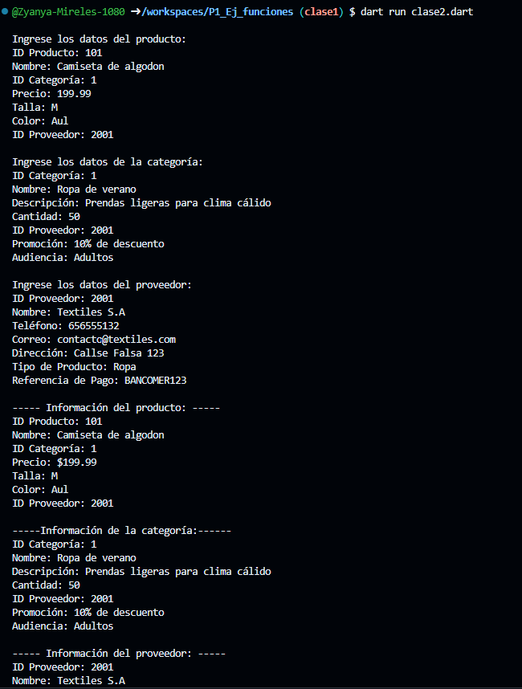
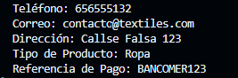

Crear una clase productos con atributos (id_producto, nombre, id_categoria, precio, talla, color, id_proveedor), una función captura() y otra mostrar_datos(), crear la instancia y utilizar los atributos y llamadas a funciones lenguaje dart (productos en base a un negocio de tienda de ropa en linea). Captura de datos por el usuario

Agrega una clase categoria con atributos (id_categoria, nombre, descripcion, cantidad, id_proveedor, promocion, audiencia)

Agrega una clase proveedor con atributos (id_proveedor, nombre, telefono, correo, direccion, tipo_producto, ref_pago)

