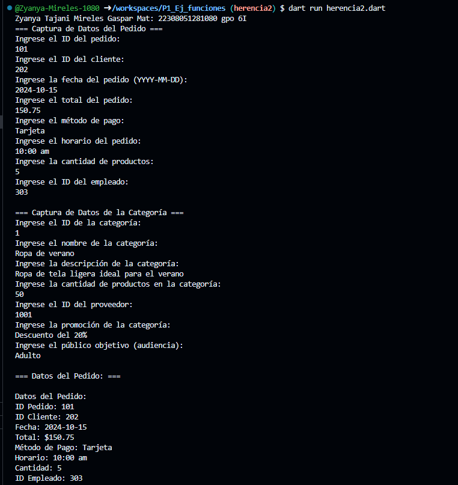
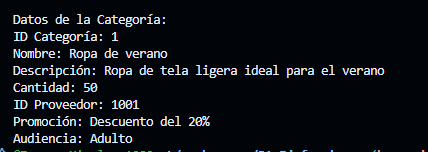

Crear la clase Pedidos con los atributos (id_pedido, id_cliente, fecha, total, metodo_pago, horario, cantidad y id_empleado) con una función capturardatos(), con interacción de inerfaz de usuario. Craer la clase DatosProductos con herencia Productos y una función mostrarDatos(). 

En el mismo código crear la clase Categoría con los atributos (id_categoria, nombre, descripcion, cantidad, id_proveedor, promocion y audiencia) con una función capturadatos(), con interacción de inerfaz de usuario. Craer la clase DatosCategoria con herencia Categoria y una función mostrarDatos(). Lenguaje dart

