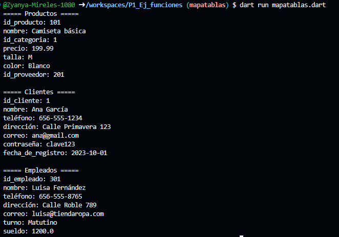

Crea tres map <String,dinamic> con los siguientes key. El negocio va entorno a una tienda de ropa
La primer tabla se llama Productos y sus key son: id_proveedor, nombre, id_categoria, precio, talla, color, id_proveedor
La segunda tabla se llama Clientes y sus key son: id_cliente, nombre, teléfono, dirección, correo, contraseña, fecha_de_registro
La tercer tabla se llama Empleados y sus key son: id_empleado, nombre, teléfono, dirección, correo, turno, sueldo
Lenguaje dart
(Lleva todo esto porque es una tienda de ropa en linea)

Salida de datos

